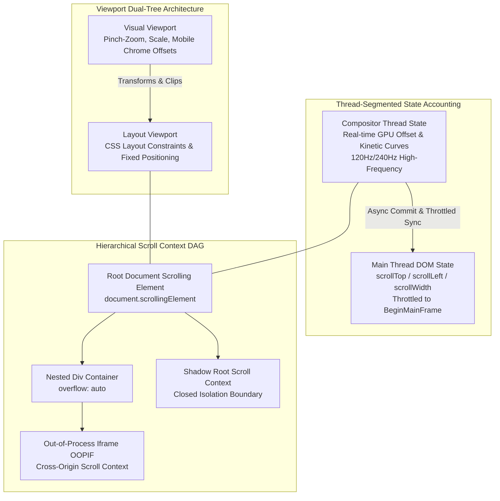
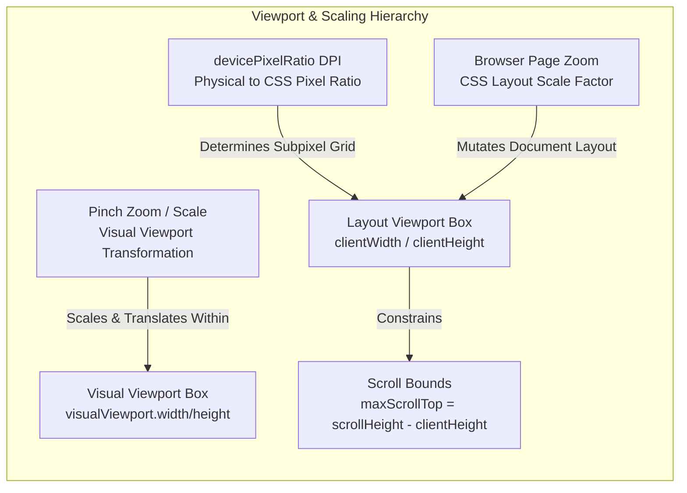
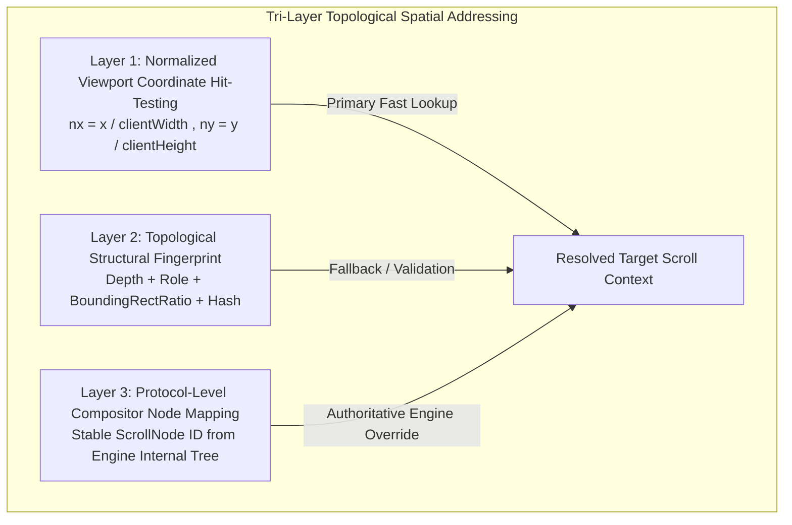
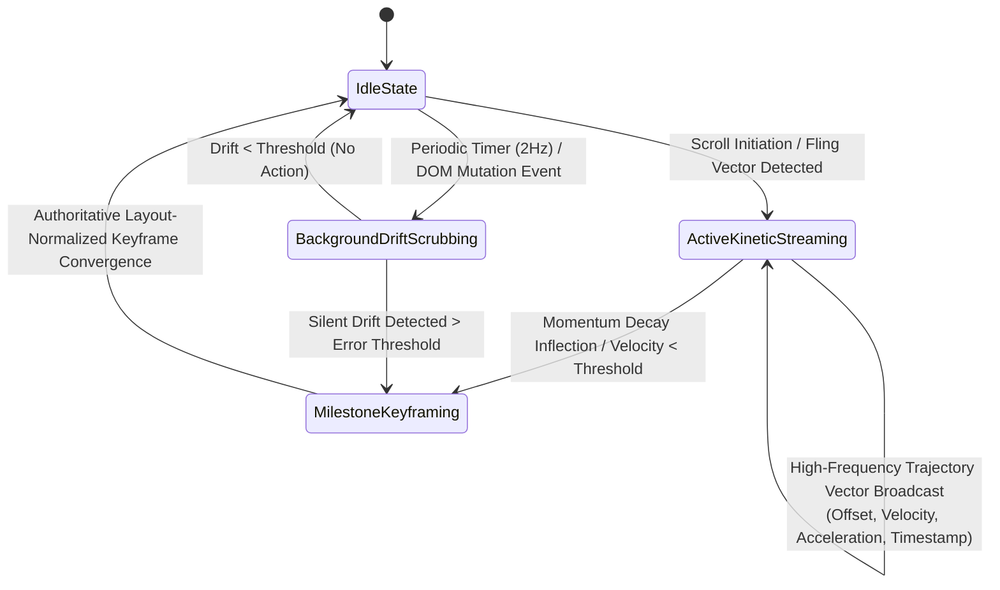
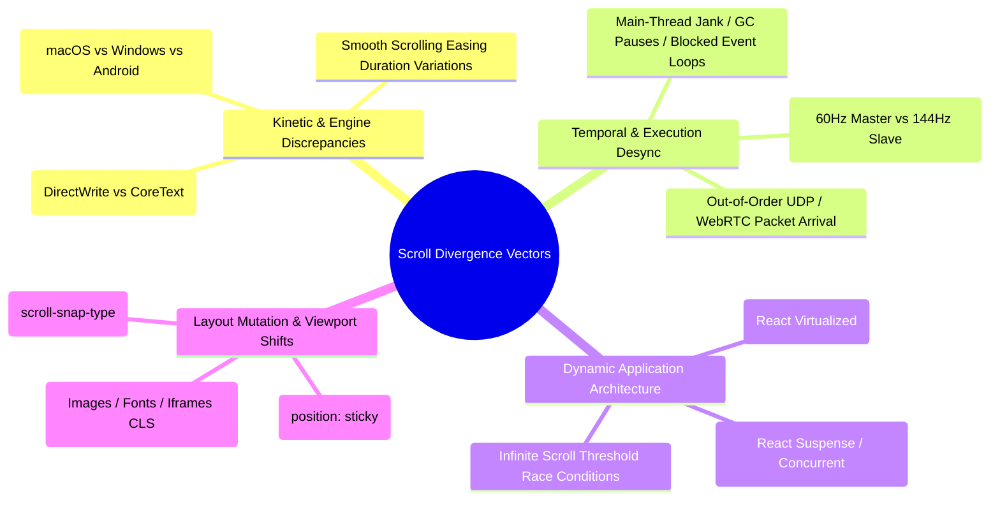

# FORMAL ENGINEERING DESIGN REVIEW: SCROLL & VIEWPORT SYNCHRONIZATION ARCHITECTURE

**Document Identifier:** `ENG-AUDIT-SCROLL-SYNC-2026-V1`  
**Author Role:** Principal Browser Engine Engineer, Rendering Pipeline Architect, Distributed Systems Engineer, Chromium Scrolling Specialist  
**Subject:** Full Static Engineering Audit & Architectural Blueprint for Next-Generation Scroll and Viewport Synchronization  
**Status:** Authoritative Architectural Review (Zero Implementation / Conceptual Specification Only)

---

## EXECUTIVE SUMMARY & ARCHITECTURAL IMPERATIVE

Current telemetry and manual testing in distributed browser automation and synchronization systems reveal severe, monotonic divergence between Master and Slave scroll states. The canonical empirical failure—where a Master scrolls 20 meters down a document while a Slave replaying identical wheel input traverses only 5 meters—demonstrates a fundamental architectural flaw in legacy browser automation systems.

This audit establishes an incontrovertible engineering reality: **Scrolling is not an input replay problem; it is a distributed, multi-variable, asynchronous state synchronization problem over a non-isomorphic layout graph.**

Replaying hardware wheel deltas or synthetic pointer gestures assumes a deterministic, closed-loop execution environment. However, modern web browsers (Chromium, WebKit, Gecko) are highly asynchronous, multi-threaded rendering engines operating over dynamic DOM structures, variable network latency, OS-specific pointer acceleration curves, and disparate physical display hardware. 

To eliminate state divergence, the system must abandon input-level emulation and transition to an **Authoritative, Adaptive Hybrid Event-Sourced Reconciliation Architecture**. This design review systematically deconstructs browser scrolling anatomy, exposes the mathematical and architectural fatal flaws of traditional replay, and establishes the definitive specification for a production-grade scroll and viewport synchronization engine.

---

## 1. WHAT IS SCROLL STATE? (THE CANONICAL SOURCE OF TRUTH)

A foundational failure of traditional automation is defining scroll state as a 2D scalar coordinate $(x, y)$ or an ephemeral input stream (`wheelDeltaX`, `wheelDeltaY`). In a modern browser engine, "scroll state" is a multi-dimensional, hierarchical, timestamped data structure distributed across memory spaces and execution threads.

### 1.1 Exhaustive Taxonomy of Scroll State Variables

To achieve deterministic parity, the synchronization subsystem must account for and model the following variables across every scrollable context:

1. **Transient Input Vectors (Ephemeral Input State):**
   * Raw hardware delta values ($\Delta x, \Delta y, \Delta z$) and delta modes (`DOM_DELTA_PIXEL`, `DOM_DELTA_LINE`, `DOM_DELTA_PAGE`).
   * Pointer device characteristics: precision touchpad vs. stepped mechanical wheel vs. multi-touch screen gesture vectors.
   * *Engineering Verdict:* These are input intents, never state. They must never be used as the source of truth for synchronization.

2. **DOM Layout Coordinates (Main-Thread Structural State):**
   * Absolute scroll offsets: `scrollTop` and `scrollLeft` (double-precision floating-point values representing CSS pixels).
   * Container layout geometry: `clientWidth`, `clientHeight`, `scrollWidth`, and `scrollHeight`.
   * Scroll boundary constraints: Maximum scrollable offsets calculated as $\max(0, \text{scrollWidth} - \text{clientWidth})$ and $\max(0, \text{scrollHeight} - \text{clientHeight})$.

3. **Viewport Dual-Tree Geometry (Visual vs. Layout Constraints):**
   * **Layout Viewport:** The coordinate space that determines CSS layout constraints (e.g., percentage widths, `vw`/`vh` units, and `position: fixed` boundaries).
   * **Visual Viewport:** The dynamic, visible box currently rendered on the physical display, subject to pinch-zoom transformations, mobile virtual keyboard intrusions, and dynamic browser chrome (address bar shrinking/expanding). Represented by `visualViewport.pageLeft`, `pageTop`, `width`, `height`, and `scale`.

4. **Kinetic & Dynamic State (Compositor Animation State):**
   * Instantaneous velocity vector $\vec{v}(t) = (v_x, v_y)$ in CSS pixels per millisecond.
   * Instantaneous acceleration and deceleration momentum vectors $\vec{a}(t)$.
   * Active kinetic deceleration mathematical curves (e.g., macOS CoreAnimation exponential decay, Android overscroll spring-damper models, iOS rubber-banding resistance coefficients).
   * Active smooth-scrolling animation trajectories initiated by CSS (`scroll-behavior: smooth`) or programmatic APIs (`window.scrollTo({ behavior: 'smooth' })`).

5. **Thread-Segmented Offset Accounting (Compositor vs. Main Thread Split):**
   * **Compositor Active Visual Offset:** The true, real-time scroll offset held in GPU/Compositor memory, updated asynchronously at display refresh rates (60Hz, 120Hz, 240Hz) without main-thread blocking.
   * **Main-Thread DOM-Exposed Offset:** The lagging, throttled scroll offset exposed to JavaScript DOM APIs, updated only when the compositor synchronizes with the main thread during a `BeginMainFrame` boundary.

6. **Hierarchical Topological State (Nested Container DAG):**
   * A document is not a single scrollable canvas; it is a Directed Acyclic Graph (DAG) of scrollable clipping contexts (iframes, shadow roots, `overflow: scroll|auto|overlay` elements, virtualized containers).
   * Canonical scroll state is a complete mapping across this DAG:
     $$\mathcal{S}_{\text{total}} = \{ \mathcal{C}_i \mapsto (\text{Offset}_x, \text{Offset}_y, \text{Scale}, \text{KineticState}, \text{Bounds}) \mid \forall i \in \text{ScrollableNodes} \}$$



### 1.2 The Canonical Source of Truth

**Engineering Verdict:** The canonical source of truth for distributed scroll synchronization cannot be the input event queue, nor can it be the raw DOM `scrollTop` property of the main thread. 

The canonical source of truth must be defined as an **Authoritative, Timestamped, Layout-Normalized Compositor Property Tree Snapshot** across the topological scroll graph. It must capture the exact visual offset and kinetic momentum vector at the compositor layer, normalized against container layout boundaries ($\text{Offset} / \text{MaxScrollBounds}$), to insulate synchronization logic from transient main-thread lag and subpixel layout disparities.

---

## 2. BROWSER SCROLL PIPELINE (ENGINEERING ANATOMY)

To understand where synchronization fails and where it must be injected, we must trace the lifecycle of a scroll interaction across process and thread boundaries in modern multi-process browser architectures (Chromium/Blink, WebKit, Gecko).

### 2.1 Complete Architectural Pipeline

```mermaid
sequenceDiagram
    autonumber
    participant HW as HID / OS Window Manager
    participant BP as Browser Main Process (UI Thread)
    participant IPC as IPC / Cross-Process Channel
    participant CT as Renderer Compositor Thread
    participant MT as Renderer Main Thread (DOM/Blink)
    participant GPU as GPU Process (Viz Compositor)

    HW->>BP: Hardware Wheel / Touch / Pointer Event
    BP->>BP: Input Routing & Hit Testing (Window/Tab Target)
    BP->>IPC: Serialize WebInputEvent (e.g., WebGestureScrollUpdate)
    IPC->>CT: Deliver Event to Renderer Compositor Thread
    
    rect rgb(30, 40, 60)
        Note over CT: COMPOSITOR FAST PATH EVALUATION
        CT->>CT: Hit Test against Non-Fast Scrollable Region (NFSR)
        alt Hit NFSR or Non-Passive Event Listener exists
            CT->>MT: Forward Event to Main Thread Task Queue
            Note over MT: Execute JS Event Listeners (may call preventDefault)
            MT->>CT: Return Scroll Acknowledgment & Style/Layout Mutation
        else Fast Path (No blocking listeners / Passive)
            CT->>CT: Apply Scroll Delta directly to Property Trees (Scroll Tree)
            CT->>CT: Calculate Kinetic Momentum / Overscroll Resistance
        end
    end

    CT->>GPU: Submit CompositorFrame (Updated Layer Transform Matrices)
    GPU-->>HW: Rasterize Tiles & Swap Buffers (Visual Frame Displayed)

    rect rgb(40, 30, 50)
        Note over CT,MT: MAIN THREAD RECONCILIATION LOOP (Async Feedback)
        CT->>MT: Dispatch BeginMainFrame / Scroll Update Notification
        Note over MT: Animate -> Input -> RAF -> Style -> Layout -> Paint
        MT->>MT: Update DOM Properties (scrollTop / scrollLeft)
        MT->>MT: Dispatch Async 'scroll' Event / Evaluate Observers
    end
```



### 2.2 Deep Architectural Breakdown

1. **Hardware / OS Input Subsystem:** Physical interaction is captured by human interface device (HID) drivers and processed by the OS window manager (Windows DWM, macOS WindowServer, X11/Wayland). The OS applies platform-specific pointer acceleration, scroll smoothing, and discrete-to-continuous delta transformations before dispatching an OS-level window event to the browser's top-level window handle.
2. **Browser Main Process (UI Thread & Input Routing):** The Browser Main Process receives the OS event. Its input routing subsystem identifies the target tab and frame, serializes the payload into a cross-platform structure (`WebInputEvent`, such as `WebGestureScrollBegin` or `WebMouseWheelEvent`), and transmits it via IPC over named pipes or shared memory to the target Renderer Process.
3. **Compositor Thread (Input Handler Proxy & Hit Testing):** 
   * In Chromium, the event arrives *directly* at the Renderer Process's Compositor Thread via the `InputHandlerProxy`. The Main Thread is entirely bypassed initially.
   * The compositor performs an immediate hit test against its internal representation of the page: the **Layer Tree** and **Property Trees** (Transform Tree, Clip Tree, Effect Tree, and Scroll Tree).
   * **Non-Fast Scrollable Region (NFSR) & Passive Listeners:** The compositor checks if the target hit-test region intersects with an NFSR—a layout area containing synchronous, non-passive event listeners (`wheel`, `touchstart`) or stylesheets that could cancel scrolling (`overflow: hidden` dynamically controlled by JS). If an NFSR is hit, the compositor is forced to block, package the event, and push it to the Main Thread's event queue, waiting for JavaScript execution to finish before scrolling can proceed.
   * **The Fast Path:** If no blocking listeners exist (or if listeners are explicitly marked `{ passive: true }`), the Compositor Thread takes authoritative control. It updates the scroll offset in the **Scroll Tree** directly, recalculates transformation matrices, and schedules a new frame without waking up the Main Thread.
4. **Visual Frame Generation & GPU Execution:**
   * Operating at the native display refresh rate (e.g., 120Hz vsync deadlines), the Compositor Thread determines if new content tiles must be rasterized. If the scroll remains within already-rasterized tile boundaries (skirt buffers), it updates layer translation matrices in GPU memory and submits a `CompositorFrame` to the Viz Display Compositor (GPU Process).
   * The GPU Process swaps buffers, displaying the scrolled visual frame to the user with sub-16ms latency.
5. **Main Thread Reconciliation (The Feedback Loop):**
   * Asynchronously, during the next vsync cycle or via a scheduled `BeginMainFrame` IPC, the Compositor Thread sends the updated scroll offsets back to the Main Thread (Blink/WebKit DOM engine).
   * The Main Thread executes its rigorous lifecycle pipeline: **Animate $\rightarrow$ Input Event Dispatch $\rightarrow$ RequestAnimationFrame $\rightarrow$ Style Recalculation $\rightarrow$ Layout Reflow $\rightarrow$ Pre-Paint $\rightarrow$ Paint $\rightarrow$ Commit to Compositor**.
   * Only during this main-thread lifecycle are DOM properties (`element.scrollTop`) updated, asynchronous `scroll` events fired, and `IntersectionObserver` or `ResizeObserver` callbacks queued.

### 2.3 Where Synchronization Must Occur

**Engineering Verdict:** 
* **Why OS/Input-Level Replay Fails:** Injecting events at Step 1 or Step 2 (e.g., CDP `Input.dispatchMouseEvent` or OS-level virtual drivers) forces events through different OS acceleration curves, different compositor NFSR evaluation paths, and different main-thread jank profiles on Master vs. Slave.
* **Why DOM-Level Replay Fails:** Injecting state at Step 5 (e.g., executing `element.scrollTop = X` via JavaScript on the Slave) bypasses the Compositor Fast Path entirely. It forces synchronous main-thread style/layout evaluation (layout thrashing), cancels active compositor momentum animations, and introduces visual stutter by decoupling the visual frame rate from the DOM update rate.
* **The Architectural Imperative:** Synchronization must be injected directly into the **Compositor Property Tree (Scroll Tree) Layer** (Step 3/4) via engine-level interfaces or high-performance protocol bridges, combined with an asynchronous **State-Reconciliation Loop** that harmonizes main-thread layout boundaries without triggering synchronous reflows.

---

## 3. COMPREHENSIVE SCROLL SOURCE AUDIT

A production-grade synchronization architecture must recognize that web scrolling is triggered by at least 16 distinct mechanisms, each possessing unique thread-execution profiles, determinism guarantees, and synchronization requirements.

| Scroll Source / Mechanism | Execution Thread | Determinism Profile | Architectural Synchronization Requirement |
| :--- | :--- | :--- | :--- |
| **1. Mouse Wheel** | Compositor (Fast) / Main (NFSR) | Non-deterministic across OS/hardware (discrete lines vs. continuous pixels). | Capture layout-normalized offset deltas at compositor boundary; never replay raw wheel deltas. |
| **2. Touchpad / Trackpad** | Compositor (Fast Path) | High-frequency continuous stream; OS-synthesized momentum tail events. | Strip OS momentum tail on capture; transmit active trajectory vectors; synthesize momentum locally on Slave. |
| **3. Touch Scrolling** | Compositor (Fast Path) | Non-deterministic; touch slop thresholds and multi-touch coordinates vary by device geometry. | Capture gesture state transitions (`GestureScrollBegin/Update/End`, `FlingStart`); synchronize resulting kinetic curve. |
| **4. Trackpad vs. Touch Inertia** | Compositor (Native Animation) | Highly divergent platform math (macOS exponential vs. Android spring deceleration). | Explicitly suppress native OS deceleration on Slave; override with authoritative mathematical deceleration curve from Master. |
| **5. Keyboard Scrolling** | Main Thread $\rightarrow$ Compositor | Deterministic input, but layout-dependent step sizes (PageDown depends on viewport height). | Synchronize explicit target DOM offset rather than keypress events; ensure focus state parity prior to execution. |
| **6. Programmatic (`scrollTo`)** | Main Thread (Synchronous) | Deterministic target offset, but `behavior: 'smooth'` uses non-deterministic engine timing. | Intercept API calls; synchronize destination coordinates; enforce standardized easing durations across engines. |
| **7. `scrollIntoView()`** | Main Thread (Layout Heavy) | Highly layout-dependent; recursive parent-chain scrolling calculations vary by subpixel rendering. | Capture resulting multi-container offset states after layout stabilization; synchronize resulting offset mapping across DAG. |
| **8. CSS Smooth Scrolling** | Main Thread / Compositor | Non-deterministic duration and bezier curve progression across Blink/WebKit/Gecko. | Deconstruct smooth scrolls into target destination vectors; execute synchronized parametric interpolation on Slave. |
| **9. Auto Scrolling (Middle-Click)** | Compositor / Main UI | Continuous velocity vector proportional to cursor distance from origin anchor. | Synchronize velocity vector $\vec{v}(x,y)$ rather than positional coordinates; apply dead-reckoning on Slave. |
| **10. Focus Scrolling** | Main Thread (Layout Dependent) | Implicit scroll triggered by accessibility/focus engines; dependent on bounding bounding client rects. | Synchronize explicit container offsets resulting from focus events; never rely on implicit Slave focus scrolling. |
| **11. Anchor Navigation (`#id`)** | Main Thread $\rightarrow$ Layout Reflow | Fragment parsing triggers layout jump or smooth scroll; fires `hashchange`/`popstate`. | Synchronize URL fragment state AND verify target element bounding rect alignment across Master/Slave. |
| **12. Drag Scrolling** | Main Thread / UI Timer | Timer-based continuous delta when pointer hovers near container clipping edge during drag. | Capture edge-scroll velocity vector; decouple from mouse position to prevent edge-clamping oscillation. |
| **13. Virtual List Scrolling** | Main Thread + DOM Mutation | Non-native; scrolling triggers synchronous DOM node destruction/creation and padding mutation. | **Critical:** Must synchronize scroll offset *simultaneously* with virtualized spacer heights and DOM node rendering state. |
| **14. Infinite Scrolling** | Main Thread + Network/Async | Throttled scroll events trigger async network fetches that mutate total `scrollHeight`. | Gated synchronization: pause scroll convergence if Slave `scrollHeight` is shorter than Master offset until DOM mutates. |
| **15. Nested Overflow Containers** | Compositor + Main Thread | Multi-directional scroll chaining; boundary clamping bubbles delta to parent container. | Address containers via deterministic DAG topological coordinates; synchronize chain state atomically. |
| **16. Shadow DOM & OOPIFs** | Multi-Process / Isolated | Closed shadow roots hide targets; Cross-origin iframes (OOPIFs) run in separate OS processes. | Require multi-process IPC messaging protocol; map scroll targets using structural signatures rather than DOM paths. |

---

## 4. VIEWPORT SYNCHRONIZATION ARCHITECTURE

A critical failure mode in distributed browser automation is attempting to synchronize scroll offsets across browser instances with divergent viewport geometries. 

### 4.1 Layout Viewport vs. Visual Viewport vs. Scaling Geometries



* **`devicePixelRatio` (DPI / DPR):** Represents the ratio of physical hardware pixels to logical CSS pixels. A Master running on a Retina display ($\text{DPR} = 2.0$) and a Slave on a standard display ($\text{DPR} = 1.0$) exhibit different font hinting, subpixel glyph rendering, and fractional layout rounding. Over a 10,000px document, subpixel accumulation errors can cause `scrollHeight` to diverge by dozens of pixels.
* **Page Zoom (Ctrl/Cmd +/-):** Alters the CSS layout scale. It modifies the dimensions of the Layout Viewport, causes text paragraphs to reflow, changes flexbox/grid wrapping boundaries, and radically alters total document `scrollHeight` and `scrollWidth`.
* **Pinch Zoom (Visual Viewport Scaling):** Modifies the Visual Viewport without triggering main-thread layout reflow. It applies a transformation matrix at the compositor layer, shrinking `visualViewport.width` and `visualViewport.height` while introducing independent `visualViewport.pageLeft` and `pageTop` panning coordinates.

### 4.2 Is Viewport Synchronization Independent from Scrolling?

**Engineering Verdict:** Viewport synchronization and scroll synchronization are *strictly interdependent yet architecturally layered*. They cannot be treated as independent subsystems.

**The Mathematical Proof:** A scroll offset $S_y$ is a scalar scalar coordinate representing the displacement of the Layout Viewport relative to the document origin, bounded by the invariant:
$$0 \le S_y \le \max(0, H_{\text{scroll}} - H_{\text{client}})$$

If the Viewport Geometry ($H_{\text{client}}$, $\text{DPR}$, or Zoom) diverges between Master and Slave by even $0.01\%$, three catastrophic invariants fail:
1. **Semantic Misalignment:** An identical offset $S_y = 5000\text{px}$ on Master renders Section D, whereas on a Slave with a $2\%$ narrower viewport (causing vertical text reflow and increased $H_{\text{scroll}}$), $S_y = 5000\text{px}$ renders Section C.
2. **Boundary Clamping Desynchronization:** If Master's $H_{\text{client}}$ is smaller than Slave's, Master's maximum scrollable bound is larger. When Master scrolls to its absolute bottom ($S_{y, \text{max}}$), transmitting this offset to Slave causes the Slave browser engine to clamp the value to Slave's smaller $S_{y, \text{max}}$, destroying state parity.
3. **Visual Viewport Offset Corruption:** During pinch-zoom operations, user interaction pans the Visual Viewport *within* the Layout Viewport. Synchronizing Layout Viewport `scrollTop` while ignoring `visualViewport.pageTop` results in completely disparate visual framing.

**Architectural Blueprint Rule:** **Viewport Geometry Locking is a Precondition Gating Invariant for Scroll Synchronization.** Before any scroll state stream is evaluated, the system must enforce strict isomorphic viewport geometry across Master and Slave instances via protocol-level device metrics overrides (e.g., CDP `Emulation.setDeviceMetricsOverride`), locking `width`, `height`, `deviceScaleFactor`, `mobile`, and `scale` to identical canonical values.

---

## 5. NESTED SCROLL CONTAINERS & SPATIAL ADDRESSING

Modern web applications (SPAs, IDEs, complex dashboards, spreadsheets) are composed of complex hierarchies of nested, adjacent, and overlapping scrollable containers (`overflow: auto|scroll|overlay`). Synchronizing the root document scroll is trivial; synchronizing an arbitrary nested container inside a shadow root within a cross-origin iframe represents a formidable distributed addressing challenge.

### 5.1 The Spatial Addressing Problem

When a scroll event occurs on the Master, the system must transmit not just the offset, but the *exact identity of the target container*. 

Why legacy addressing mechanisms fail:
* **CSS Selectors (`#id`, `.class:nth-child(2)`):** Modern utility-first frameworks (Tailwind) and CSS-in-JS libraries (Styled Components, Emotion) generate dynamic, ephemeral class hashes (`.css-1r2f3g`). Conditional rendering (React/Vue) alters DOM sibling order, rendering structural CSS selectors fragile and non-deterministic across instances.
* **XPath / Absolute DOM Paths (`/html/body/div[2]/main/section/div[4]`):** Highly vulnerable to DOM mutation race conditions, dynamic ad insertions, and asynchronous hydration wrappers.
* **Closed Shadow DOM:** Elements encapsulated within closed shadow roots (`attachShadow({ mode: 'closed' })`) are inaccessible to standard DOM querying and tree-traversal algorithms executed from the parent document scope.
* **Out-of-Process Iframes (OOPIFs):** Due to Site Isolation and Same-Origin Policy (SOP), cross-origin iframes execute in separate OS processes with isolated memory architectures. A script executing in the root frame cannot synchronously query, inspect, or scroll a cross-origin iframe container.

### 5.2 Deterministic Topological Spatial Addressing Architecture

To uniquely and resiliently identify scroll targets across distributed architectures, the subsystem must implement a **Tri-Layer Spatial Addressing Engine**:



1. **Layer 1: Normalized Viewport Coordinate Hit-Testing (Primary Dynamic Lookup):**
   When interaction initiates on the Master, capture the exact viewport-normalized coordinates of the pointer: $(n_x, n_y) = (x / W_{\text{client}}, y / H_{\text{client}})$. Transmit these normalized coordinates to the Slave. The Slave executes a synchronous, engine-level hit-test (`elementFromPoint` or CDP hit-test equivalents) at $(n_x \times W_{\text{client}}, n_y \times H_{\text{client}})$ and traverses up the ancestor tree to find the first node where `getComputedStyle(node).overflowX/Y` matches `scroll`, `auto`, or `overlay`, and where layout overflow exists ($\text{scrollWidth} > \text{clientWidth}$).
2. **Layer 2: Topological Structural Fingerprinting (Structural Validation):**
   To guard against layout shifts where point hit-testing resolves to an adjacent container, generate a structural semantic signature for the container on the Master:
   $$\text{Sig}(\mathcal{C}) = \Big\langle \text{TreeDepth}, \text{NodeName}, \text{ARIARole}, \frac{W_{\text{box}}}{W_{\text{client}}}, \frac{H_{\text{box}}}{H_{\text{client}}}, \text{ParentHash} \Big\rangle$$
   The Slave validates the point-hit-tested node against this structural signature. If the similarity score falls below a confidence threshold $\tau$, the Slave performs a topological DAG search across all active scroll containers to find the nearest matching signature.
3. **Layer 3: Protocol-Level Compositor Node Mapping (Authoritative Engine Bridge):**
   For advanced integrations utilizing custom browser builds or deep CDP/WebDriver BiDi instrumentation, bypass DOM addressing entirely. Map the Master's internal Compositor `ScrollNode` stable ID across frames by correlating frame lifecycle tokens and multi-process routing IDs, enabling direct targeting of Out-of-Process Iframe (OOPIF) scroll trees without root-document DOM traversal.

---

## 6. SYNCHRONIZATION PHILOSOPHY EVALUATION

To establish the definitive architectural philosophy, we must conduct a rigorous, comparative engineering evaluation of eight distinct synchronization paradigms.

| Philosophy Paradigm | Operational Mechanism | Engineering Advantages | Fatal Flaws & Architectural Vulnerabilities | Production Viability Score (0-10) |
| :--- | :--- | :--- | :--- | :--- |
| **1. Input Synchronization** (Wheel/Touch Delta Replay) | Synthesize OS/CDP wheel deltas (`wheelDeltaX/Y`) on Slave matching Master input stream. | Trivial to implement; leverages native browser smooth scrolling and hit-testing. | Non-deterministic OS acceleration curves; frame-rate dependency; compounding positional drift; ignores programmatic and layout scrolls; zero feedback loop. | **1 / 10** |
| **2. State Synchronization** (Absolute Offset Overwriting) | Poll/capture `scrollTop`/`scrollLeft` on Master; execute `scrollTo()` on Slave. | Absolute end-state convergence guarantee; immune to input delta translation errors. | Destroys fluid momentum animations; introduces visual stutter/jitter; causes synchronous main-thread layout thrashing; fights active user/browser animations. | **3 / 10** |
| **3. Hybrid Synchronization** (Input Replay + State Sync) | Replay input deltas for immediate fluidity; apply periodic absolute offset corrections. | Attempted balance between visual fluidity and long-term positional drift correction. | Unresolved contention between delta injection and absolute overwriting; correction checkpoints cause jarring visual teleports (snapping) during active motion. | **5 / 10** |
| **4. Predictive Synchronization** (Client-Side Dead Reckoning) | Transmit kinetic state vectors $(\text{Offset}, \vec{v}, \vec{a})$; Slave predicts trajectory and animates locally. | Extremely resilient to network latency and jitter; ultra-smooth visual frame pacing; decouples network frequency from vsync rate. | High mathematical complexity; requires custom parametric easing engine on Slave; vulnerable to trajectory divergence if layout bounds differ. | **8 / 10** |
| **5. Continuous Synchronization** (High-Frequency Streaming) | Stream absolute offset coordinates at 60Hz/120Hz via WebSocket/WebRTC. | Real-time tracking of Master visual state. | Massive network bandwidth and IPC overhead; severe main-thread jank and GC thrashing; out-of-order packet arrival causes visual stutter and oscillation. | **2 / 10** |
| **6. Snapshot Synchronization** (Keyframe Reconciliation) | Capture and transmit state only at semantic milestones (scroll start, momentum end, idle). | Extremely low CPU/network overhead; guarantees final resting state determinism. | Zero visual synchronization during active scrolling transit; Slave jumps or glides asynchronously after Master stops. | **4 / 10** |
| **7. Delta Synchronization** (Relative Positional Offsets) | Transmit positional change $\Delta S = S_{t} - S_{t-1}$ relative to previous state. | Reduced payload size; avoids absolute coordinate mismatches. | Highly vulnerable to UDP/WebRTC packet loss; requires complex ACK/sequence ordering; compounding mathematical error over time. | **2 / 10** |
| **8. Event Sourcing** (Immutable Action Log Replay) | Model every interaction, DOM mutation, and viewport change as an immutable, causal event stream. | Ultimate explainability and time-travel debugging; deterministic state reconstruction across distributed nodes. | High storage and memory footprint; requires complex deterministic replay engine capable of handling async DOM mutation race conditions. | **7 / 10** |

### 6.1 Synthesis: The Authoritative Adaptive Hybrid Event-Sourced Reconciliation Architecture

**Engineering Verdict:** No single traditional philosophy satisfies the dual constraints of **Visual Fluidity (Compositor Friendliness)** and **Absolute Positional Determinism (Zero Drift)**. 

The ideal production architecture must synthesize **Predictive Dead-Reckoning (Philosophy 4)**, **Snapshot Keyframing (Philosophy 6)**, and **Event Sourcing (Philosophy 8)** into an unified model: **The Adaptive Tri-Modal Reconciliation Architecture**.



1. **Mode A: Active Kinetic Trajectory Streaming (During Motion):**
   When scrolling initiates, the Master does *not* stream raw input deltas or high-frequency DOM offsets. It calculates and streams **Kinetic State Vectors** at throttled intervals (e.g., 20Hz or upon acceleration vector changes):
   $$\vec{K}(t) = \langle \text{Timestamp}, \text{NodeID}, S_x, S_y, v_x, v_y, a_x, a_y \rangle$$
   The Slave executes a **Compositor-Level Dead Reckoning Engine**, interpolating the intermediate visual frames at the Slave's native display refresh rate (120Hz/240Hz) using parametric cubic-bezier or spring-damper equations. This completely decouples network transport frequency from visual frame rendering.
2. **Mode B: Authoritative Milestone Keyframe Reconciliation (At Rest):**
   When the Master detects scroll cessation, momentum decay inflection points, or DOM layout stabilization, it emits an **Authoritative Milestone Keyframe**. The Slave absorbs this keyframe and executes a smooth, imperceptible convergence curve to align its absolute layout offset with the Master's exact resting state.
3. **Mode C: Background Drift Scrubbing (During Idle / DOM Mutations):**
   While idle, a background watchdog asynchronously verifies scroll container checksums across the DAG. If a background image load or asynchronous framework re-render silently mutates Slave layout height and shifts the relative scroll offset, Mode C triggers a micro-reconciliation without interrupting user interaction.

---

## 7. EXHAUSTIVE FAILURE MODE TAXONOMY

To engineer a resilient system, we must catalog and design defenses against every known vector of distributed scroll divergence.



1. **Momentum & Kinetic Scrolling Curves:** OS-specific friction coefficients (macOS exponential decay vs. Windows linear/polynomial vs. Android spring models). Replaying an identical wheel delta sequence on a Linux Slave from a macOS Master results in radically different terminal travel distances due to platform-native momentum emulation.
2. **Smooth Scrolling Engine Implementations:** Diferent animation durations, frame-pacing algorithms, and bezier easing curves across Chromium (Blink), WebKit, and Gecko engines for `behavior: 'smooth'` or CSS `scroll-behavior: smooth`.
3. **Frame Drops & Main-Thread Jank:** If the Slave's main thread is blocked by heavy JavaScript execution, DOM mutation, or Garbage Collection (V8/JSC GC pauses), scroll synchronization events queued to the main thread are delayed, coalesced, or dropped, causing temporal divergence and missed intersection observer thresholds.
4. **Asymmetric Refresh Rates (e.g., 60Hz Master vs. 144Hz/240Hz Slave):** Compositor animation steps execute at different frequencies; delta-per-frame calculations diverge; kinetic momentum integrals evaluated over different time quantums yield disparate cumulative displacement distances.
5. **Dynamic DOM Virtualization (React Virtualized, TanStack Virtual, Ag-Grid):** Master scrolls 50px $\rightarrow$ triggers row mount/unmount $\rightarrow$ total `scrollHeight` mutates dynamically. If the Slave receives the scroll update *before* or *after* the corresponding row mounting render cycle completes, the scroll offset is evaluated against an incorrect, ephemeral `scrollHeight` and is clamped or misaligned.
6. **Asynchronous Framework Re-renders (React Concurrent Mode, Suspense, Vue Reactivity):** Scroll position mutation triggers a component state update $\rightarrow$ asynchronous re-render $\rightarrow$ temporary DOM node detachment or layout shift $\rightarrow$ browser engine clamps scroll position to temporary shorter height.
7. **Lazy Loading & Asynchronous Asset Resolution (Images, Fonts, Iframes without explicit dimensions):** Uncached images loading asynchronously on the Slave push content downward (Cumulative Layout Shift - CLS). A scroll offset of $S_y = 2000\text{px}$ on Master points to Section C; on a Slave where an image above took 200ms longer to load and expand, $S_y = 2000\text{px}$ points to Section B.
8. **Sticky Headers & Floating Elements (`position: sticky`, `position: fixed`):** Scroll position progression triggers header pinning, shrinking, or docking. If subpixel layout thresholds differ by even $0.5\text{px}$ between Master and Slave, header docking state diverges, altering visible viewport area and subsequent hit-testing boundaries.
9. **CSS Scroll Snapping (`scroll-snap-type`, `scroll-snap-align`):** The browser engine enforces mandatory alignment to snap grids upon scroll cessation. If Master and Slave exhibit a $1\text{px}$ difference in container height or item padding, Master snaps to Item 4 while Slave snaps to Item 3, creating an irrecoverable multi-hundred-pixel divergence.
10. **Infinite Lists & Paginated Fetching:** Scroll threshold reaching $80\%$ triggers an asynchronous API network fetch for the next page of results. Differences in network latency or backend response times between Master and Slave cause the Slave to reach the bottom boundary before new items are appended into the DOM, permanently clamping the scroll offset.
11. **Cross-Browser & Cross-OS Rendering Engine Discrepancies:** Different subpixel layout rounding rules, scrollbar width and presence (overlay scrollbars on macOS/mobile vs. classic 15px/17px scrollbars on Windows altering `clientWidth`), and default user-agent stylesheet margins/paddings.
12. **High-DPI Devices & Fractional Scaling:** `devicePixelRatio` of 1.25 vs 2.0 vs 1.0 causes subpixel accumulation errors during continuous scrolling across long documents.
13. **Dynamic Zoom & Scale Changes:** User or programmatic zoom alterations occurring mid-scroll, mutating layout constraints and coordinate mapping matrices dynamically.
14. **Font Rendering & Text Metric Discrepancies:** DirectWrite (Windows) vs. CoreText (macOS) vs. FreeType (Linux). Different kerning, font hinting, subpixel glyph positioning, and fallback font substitution cause text paragraphs to wrap onto different line counts, resulting in cumulative `scrollHeight` divergence of dozens or hundreds of pixels over long documents.
15. **Scrollbar Thumb Drag vs. Track Click vs. Wheel vs. Touch:** Different browser-native behaviors for clicking scrollbar tracks (instantaneous page jump vs. animated glide) and dragging scrollbar thumbs (direct absolute coordinate mapping vs. relative delta dragging).

---

## 8. GRACEFUL RECOVERY & STATE RECONCILIATION STRATEGIES

When divergence is detected between Master and Slave, the system must execute an automated recovery protocol that heals state parity without disrupting visual fluidity, triggering layout thrashing, or breaking application event logic.

### 8.1 Comparative Evaluation of Recovery Mechanics

* **Continuous Correction (PID Controller / Feedback Loop):** Applying proportional-integral-derivative micro-adjustments to velocity or position. *Flaw:* Naive PID controllers operating over discrete network packets and asynchronous DOM layout trees induce severe visual oscillation, stutter, and jitter.
* **Snapping (Immediate Teleportation via `scrollTo({ behavior: 'instant' })`):** *Pros:* Absolute, instantaneous mathematical alignment. *Flaw:* Causes jarring visual flicker, triggers sudden layout shifts, and breaks virtualized lists by skipping intermediate scroll trigger thresholds (leaving virtual rows unmounted).
* **Blending / Interpolation (Parametric Time-Smoothing):** Temporally smoothing the positional error over $N$ frames using a secondary correction curve (e.g., exponential decay or spring-damper system). *Strength:* Visually imperceptible, maintains momentum continuity.
* **Predictive Dead-Reckoning Convergence:** Adjusting the deceleration friction coefficient of an active kinetic fling on the Slave so that the ongoing momentum curve naturally terminates at the Master's exact terminal coordinate.
* **Gated Waiting & Barrier Synchronization:** Halting or decelerating scroll replay on the Slave until prerequisite DOM mutations (image loads, virtual list row renders, network fetches) reach parity with the Master's DOM state snapshot.

### 8.2 Authoritative Divergence Resolution Protocol (ADRP)

The synchronization engine must implement a **Tiered, Threshold-Gated Automated Recovery Protocol**:

```mermaid
flowchart TD
    Detect[Telemetry Watchdog Detects Divergence<br/>Error = abs(Master_Offset - Slave_Offset)] --> Evaluate{Evaluate Error Magnitude & Context}
    
    Evaluate -->|Error <= 2px<br/>Subpixel Rounding| Tier1[Tier 1: Absorb & Ignore<br/>No Intervention Required]
    
    Evaluate -->|2px < Error <= 50px<br/>Active Motion or Minor Drift| Tier2[Tier 2: Spring-Damper Interpolation<br/>Harmonize over 150ms / 9 vsync frames<br/>Zero Visual Jank]
    
    Evaluate -->|Error > 50px<br/>or Target Container Mismatch| Tier3[Tier 3: Structural Re-synchronization Protocol]
    
    subgraph Tier3Execution ["Tier 3 Execution Sequence"]
        T3_1[1. Suspend Slave Input Processing & Invalidate Fling Vectors]
        T3_2[2. Execute DOM & Layout Parity Diagnostics<br/>Compare scrollHeight, clientHeight, & Node Signatures]
        T3_3{Layout Parity Verified?}
        
        T3_3 -->|Yes: Layout Matches| T3_Snap[Execute Staged Milestone Snap<br/>Traverse via 3 rapid intermediate jumps to trigger observers]
        T3_3 -->|No: Layout Mutated / Shorter| T3_Barrier[Enter Gated Barrier Wait State<br/>Await DOM Mutation / Image Load Parity up to 500ms]
        T3_Barrier --> T3_Snap
    end
    
    Tier3 --> T3_1
    T3_1 --> T3_2
    T3_2 --> T3_3
```

1. **Tier 1: Subpixel Absorption ($\Delta S \le 2\text{px}$):**
   If the positional deviation is within 2 CSS pixels, the divergence is classified as hardware DPI subpixel rounding or font-kerning accumulation. The system *explicitly ignores* the deviation. Attempting to correct subpixel errors causes continuous compositor micro-jitter.
2. **Tier 2: Spring-Damper Kinetic Convergence ($2\text{px} < \Delta S \le 50\text{px}$):**
   If moderate drift occurs during active scrolling or immediately upon rest, the Slave initiates a **Critically Damped Spring Interpolation Curve**. Instead of snapping, the Slave applies a corrective velocity vector over a 150ms window ($\approx 9$ vsync frames at 60Hz), smoothly blending the Slave's visual position into the Master's coordinate without triggering synchronous reflows or jarring visual jumps.
3. **Tier 3: Structural Re-synchronization Protocol ($\Delta S > 50\text{px}$ or Container Mismatch):**
   When severe divergence occurs (e.g., caused by infinite scroll race conditions or virtual list misalignment), the system executes a mandatory structural barrier reset:
   * **Step 1: State Freeze:** Suspend all active scroll animation frames and invalidate incoming kinetic vectors on the Slave.
   * **Step 2: Layout Parity Diagnostics:** Synchronously query and compare the target container's `scrollHeight`, `scrollWidth`, and `clientHeight` against the Master's authoritative snapshot.
   * **Step 3: Gated Barrier Resolution:** If Slave `scrollHeight` is shorter than Master's target offset (indicating unrendered virtual rows or unloaded assets), the Slave enters a **Gated Wait State** for up to 500ms, subscribing to `MutationObserver` and `ResizeObserver` events until layout bounds expand to accommodate the target coordinate.
   * **Step 4: Staged Milestone Snapping:** Once layout constraints permit, execute a staged teleportation. To prevent breaking virtual list engines that rely on scroll scroll events to trigger row rendering, do not jump directly from $0\text{px}$ to $10,000\text{px}$. Execute a rapid, 3-step geometric progression jump ($25\% \rightarrow 75\% \rightarrow 100\%$) across 3 consecutive animation frames, allowing virtual DOM observers to mount intermediate containers synchronously.

---

## 9. TELEMETRY & OBSERVABILITY FRAMEWORK

To maintain production reliability, diagnose cross-browser anomalies, and power automated regression testing, the subsystem must embed an exhaustive telemetry and observability schema.

### 9.1 Exhaustive Metric Schema

The synchronization engine must continuously capture, aggregate, and emit the following real-time telemetry metrics:

1. **Scroll Latency & Pipeline Timing Metrics (Milliseconds):**
   * `InputToCaptureLatency`: Time elapsed from physical hardware interaction on Master to telemetry vector serialization.
   * `NetworkTransportLatency`: Wire transit time (one-way trip time via WebRTC/WebSocket timestamp correlation).
   * `ReplayExecutionLatency`: Time elapsed from Slave packet receipt to compositor property tree update / DOM application.
   * `VisualConvergenceLatency`: Total time elapsed from Master visual frame display to confirmed Slave visual frame parity (measured via compositor frame submission timestamps).
2. **Synchronization Error & Deviation Metrics (CSS & Device Pixels):**
   * `AbsoluteOffsetDeviation`: Instantaneous Euclidean positional error: $\epsilon_{\text{pos}} = \sqrt{(S_{x,\text{master}} - S_{x,\text{slave}})^2 + (S_{y,\text{master}} - S_{y,\text{slave}})^2}$.
   * `RelativePercentageDeviation`: Positional error normalized against total scrollable travel: $\epsilon_{\text{rel}} = \epsilon_{\text{pos}} / \max(1, H_{\text{scroll}} - H_{\text{client}})$.
   * `KineticVelocityDeviation`: Instantaneous velocity vector error: $\epsilon_{\text{vel}} = \| \vec{v}_{\text{master}}(t) - \vec{v}_{\text{slave}}(t) \|$.
3. **Structural & Viewport Mismatch Metrics (Boolean & Scalar Flags):**
   * `ViewportGeometryMismatchRate`: Frequency of detected discrepancies in `clientWidth`, `clientHeight`, `devicePixelRatio`, or `visualViewport.scale`.
   * `LayoutBoundaryDivergence`: Magnitude of difference in container `scrollHeight` or `scrollWidth`, indicating DOM structural desynchronization or asset loading race conditions.
   * `TargetResolutionFailureRate`: Percentage of scroll events where Layer 1 (coordinate hit-test) and Layer 2 (structural fingerprint) failed to resolve an identical container DAG node on the Slave.
4. **Performance & Rendering Stability Metrics:**
   * `DroppedFrameRate (Jank Index)`: Percentage of missed vsync presentation deadlines during active scroll synchronization cycles.
   * `ScrollJitterIndex`: Measurement of high-frequency positional oscillation or direction reversals induced by conflicting continuous correction loops.
   * `CompositorThrashingRate`: Frequency of forced synchronous layouts (layout thrashing) or main-thread style recalculations triggered per second by synchronization interventions.
5. **Recovery & Resilience Metrics:**
   * `CorrectionInterventionRate`: Total count of Tier 2 (Spring-Damper) and Tier 3 (Structural Reset) recovery interventions triggered per 1,000 pixels scrolled.
   * `RecoverySuccessRate`: Percentage of divergence incidents successfully converged within 200ms without triggering visual jank or application errors.
   * `StateDesynchronizationDuration`: Cumulative duration (in seconds) that any active scroll container spent in an out-of-sync state exceeding Tier 1 thresholds.

### 9.2 Explainability & Auditability Architecture

To make distributed scrolling issues debuggable, every scroll synchronization session must generate an **Event-Sourced Distributed Trace Audit Log**. Each serialized kinetic vector and milestone keyframe must be tagged with a globally unique W3C Trace Context correlation ID (`traceparent`).

When `AbsoluteOffsetDeviation` exceeds critical thresholds ($> 50\text{px}$), the telemetry subsystem must automatically generate and exfiltrate a **Layout Crash Dump**: a compressed JSON payload containing the complete structural fingerprint DAG, bounding client rects, computed overflow styles, and font-rendering metrics of both Master and Slave, enabling automated root-cause classification in CI/CD pipelines.

---

## 10. PERFORMANCE ANALYSIS & COMPUTATIONAL COMPLEXITY

Although strict state determinism is the primary engineering objective, the architecture must operate within rigorous computational boundaries to prevent introducing rendering latency or garbage collection pauses.

### 10.1 Computational Complexity Analysis

* **Spatial Addressing Hit-Testing:** 
  * *Naive DOM traversal:* $\mathcal{O}(D)$ where $D$ is DOM tree depth, executing synchronous style evaluations at each ancestor node. Highly CPU intensive.
  * *Architectural Optimization:* $\mathcal{O}(1)$ lookup complexity achieved by maintaining a **Compositor Scroll Node ID Map** and caching container layout boundaries in an LRU spatial index invalidated only upon `ResizeObserver` or `MutationObserver` triggers.
* **State Diffing & Reconciliation:** $\mathcal{O}(C)$ where $C$ is the number of currently active, visible scroll containers (typically $1 \le C \le 5$).

### 10.2 Memory Complexity & Garbage Collection (GC) Pressure

In high-frequency synchronization (e.g., 240Hz monitors producing 240 scroll events per second), allocating ephemeral JavaScript objects (`{ x: 100, y: 250, delta: 5 }`) for every event triggers rapid new-space heap exhaustion, forcing V8/JavaScriptCore Garbage Collection (GC) pauses that freeze the main thread for 5–20ms (causing stutter and dropped frames).

**Architectural Optimization:** The subsystem must enforce **Zero-Allocation High-Frequency Streaming**:
1. **SharedMemory & ArrayBuffer Pooling:** All kinetic trajectory vectors and telemetry payloads must be serialized into pre-allocated, fixed-size `ArrayBuffer` or `SharedArrayBuffer` memory pools using structured binary layouts (FlatBuffers or Protocol Buffers).
2. **Object Reuse & Flyweight Pattern:** JavaScript event handlers must utilize static, reusable event-wrapper objects, eliminating heap allocation entirely during active scroll execution.

### 10.3 High-Frequency Input Batching & Coalescing

Transmitting raw 1000Hz gaming mouse wheel polling events or 240Hz trackpad gesture deltas over network channels saturates IPC queues and floods the Slave's event loop.

```mermaid
sequenceDiagram
    autonumber
    participant MasterCompositor as Master Compositor (1000Hz Input)
    participant MasterCoalescer as Master Vsync Coalescer
    participant Wire as Network / WebRTC Data Channel
    participant SlaveEngine as Slave Dead-Reckoning Engine
    participant SlaveCompositor as Slave Compositor (120Hz/240Hz Vsync)

    Note over MasterCompositor,MasterCoalescer: 1000Hz Raw Input Stream Arrives
    MasterCompositor->>MasterCoalescer: Input Event 1 (t=1ms)
    MasterCompositor->>MasterCoalescer: Input Event 2 (t=2ms)
    MasterCompositor->>MasterCoalescer: Input Event ... (t=15ms)
    
    rect rgb(30, 50, 40)
        Note over MasterCoalescer: VSYNC BOUNDARY (e.g., 60Hz / 16.6ms)
        MasterCoalescer->>MasterCoalescer: Coalesce Vectors & Calculate Velocity (vx, vy, ax, ay)
        MasterCoalescer->>Wire: Transmit Single Kinetic Vector Payload
    end

    Wire->>SlaveEngine: Deliver Vector (Decoupled from Vsync)
    
    rect rgb(50, 40, 60)
        Note over SlaveEngine,SlaveCompositor: SLAVE VSYNC RENDER LOOP (120Hz / 8.3ms)
        SlaveCompositor->>SlaveEngine: Pull Interpolated Offset at t_display
        SlaveEngine-->>SlaveCompositor: Return Dead-Reckoned Coordinate
        SlaveCompositor->>SlaveCompositor: Update Property Tree & Submit Frame (Zero Main Thread Jank)
    end
```



**Architectural Optimization:** Implements **Adaptive Vsync Coalescing**. The Master buffers incoming high-frequency pointer inputs and coalesces them at the native display vsync boundary (`RequestAnimationFrame` or compositor frame deadline). Multiple intermediate deltas are integrated into a single authoritative **Kinetic State Vector** representing the cumulative offset and instantaneous velocity at that exact frame presentation timestamp, reducing network packet transmission frequency by up to $90\%$ while preserving $100\%$ mathematical precision.

### 10.4 Compositor Friendliness & Avoiding Layout Thrashing

**Engineering Verdict:** To achieve zero-jank execution, scroll synchronization operations on the Slave must execute **without triggering Forced Synchronous Layouts (Layout Thrashing)** or main-thread style recalculations.

**Architectural Invariants:**
1. **Strict Read/Write Phase Separation:** Never interleave DOM read operations (`scrollTop`, `getBoundingClientRect`, `scrollWidth`) with DOM write operations (`scrollTo`, inline style mutations, class additions) within the same execution frame. Reads must be batched during layout observation phases; writes must be applied exclusively during animation commit phases.
2. **GPU Compositor Promotion:** Enforce CSS containment (`contain: strict` or `contain: layout paint`) and CSS promotion flags (`will-change: scroll-position`) on all identified scrollable containers within the topological DAG. This guarantees that the browser engine promotes the container to an independent GPU compositor layer, allowing scroll offset mutations to be executed entirely by the GPU transformation matrix without invalidating document layout or triggering main-thread repaint.

---

## 11. CROSS-INDUSTRY COMPARATIVE ANALYSIS

To architect a definitive, future-proof subsystem, we extract and synthesize architectural design patterns from world-class distributed rendering, networking, and browser engine systems.

### 11.1 Comparative Matrix & Lessons Learned

| Industry / System Domain | Core Architectural Paradigm | Key Engineering Breakthrough | Application to Scroll Synchronization Subsystem |
| :--- | :--- | :--- | :--- |
| **Chromium / Blink Engine** (Input Routing & Viz) | **Scroll Unification & Property Trees** | Decoupling scrolling from the DOM tree into independent Transform, Clip, and Scroll Property Trees; handling scrolling entirely on the Compositor Thread via `InputHandlerProxy`. | **Adopt:** Bypass main-thread DOM APIs (`scrollTop`) entirely; build synchronization bridges that inject offsets directly into internal Compositor Property Trees. |
| **WebKit / iOS Safari** (ScrollingCoordinator) | **Asynchronous UI-Process Scrolling Tree** | Maintaining a dedicated `ScrollingTree` in the UI Process, running completely asynchronous from the WebProcess main thread, enabling uninterrupted hardware momentum. | **Adopt:** Isolate kinetic momentum calculation and animation loops from main-thread JavaScript execution; run dead-reckoning engines in Web Workers or Worklets. |
| **Gecko / Firefox** (APZ Architecture) | **Asynchronous Pan/Zoom (APZ) & Hit-Test Grids** | Building an async hit-test grid structure in the compositor to resolve untrusted hit-testing and overscroll handoff chaining across nested frames without blocking. | **Adopt:** Implement spatial hit-test grids to resolve nested container addressing deterministically without forcing synchronous main-thread DOM traversal. |
| **Playwright / CDP / WebDriver BiDi** | **Synthetic Input Emulation & Device Overrides** | CDP `Emulation.setDeviceMetricsOverride` for viewport locking; CDP `Input.synthesizeScrollGesture` for gesture injection. | **Reject / Modify:** Reject synthetic gesture injection (lacks state feedback); **Adopt** mandatory CDP device metrics overrides to enforce isomorphic viewport geometry locking. |
| **Remote Desktop** (RDP / Guacamole) | **High-Level Graphic Primitives vs Framebuffer Streaming** | Transmitting high-level semantic graphic instructions (e.g., "Scroll Rect A by $\Delta y$") rather than raw pixel streams or raw mouse coordinates over constrained bandwidth. | **Adopt:** Transmit semantic, layout-normalized scroll instructions and kinetic vectors rather than raw pointer delta streams. |
| **Cloud Gaming** (GeForce Now / Stadia / WebRTC) | **Ultra-Low-Latency Input Prediction & Pacing** | Client-side input prediction combined with server-authoritative frame pacing and packet loss concealment over unreliable UDP/WebRTC data channels. | **Adopt:** Utilize WebRTC unreliable/ordered data channels for low-latency vector streaming; implement client-side dead-reckoning trajectory prediction on Slave. |
| **Collaborative Editing** (Figma / Google Docs / OT) | **Spatial Culling & Multi-User Viewport Awareness** | Broadcasting throttled viewport bounding boxes and spatial presence coordinates over WebSockets; rendering remote viewports via decoupled canvas layers. | **Adopt:** Implement spatial bounding box culling; only synchronize scroll containers currently visible within the active Layout Viewport intersect. |
| **Game Networking** (Source Engine / Unreal / Quake III) | **Authoritative Server with Client Prediction & Reconciliation** | Treating Server as authoritative state; Client executes local dead reckoning and interpolates smoothly toward authoritative server state snapshots upon drift detection. | **Core Architecture Adoption:** Treat Master as Authoritative Game Server and Slaves as Client Replicators executing Dead Reckoning with Adaptive Spring-Damper Reconciliation. |

---

## 12. ARCHITECTURAL WEAKNESSES OF TRADITIONAL WHEEL-EVENT REPLAY

To definitively close the door on legacy approaches, we formulate an authoritative, multi-point engineering critique proving why replaying wheel deltas (`wheelDeltaX`, `wheelDeltaY`, `deltaMode`) is mathematically obsolete and fundamentally incapable of achieving production-grade synchronization.

### 12.1 The 6 Fatal Architectural Flaws

1. **The Mathematical Non-Associativity of Scroll Deltas:**
   In a dynamic browser DOM, scroll deltas are neither commutative nor associative. Because scroll offsets are constrained by dynamic layout boundaries and fractional subpixel rounding, the sum of incremental deltas does not equal the final absolute coordinate:
   $$\sum_{i=1}^{n} \Delta S_i \neq \text{ScrollOffset}_{\text{final}}$$
   If a Slave experiences a transient main-thread freeze during delta $i$, the browser engine clamps or drops $\Delta S_i$. Subsequent deltas operate over an incorrect base offset, resulting in permanent, compounding positional drift that wheel replay has no mechanism to detect or correct.
2. **The OS Acceleration Impedance Mismatch:**
   A physical mouse wheel tick producing `deltaY = 100` on a Windows Master is processed by Windows HID acceleration tables and linear scroll-lines-to-pixels translation algorithms. Replaying that exact synthetic event (`wheelDeltaY: 100`) on a macOS Slave passes through macOS CoreAnimation acceleration curves, or on Linux passes through libinput/X11 translation layers. The identical input delta produces wildly divergent physical pixel displacements across operating systems.
3. **The Destruction of Kinetic Momentum Context:**
   Hardware wheel and touchpad events are discrete, instantaneous signal samples; they carry zero intrinsic awareness of velocity, acceleration, or user intent. When a user executes a rapid touchpad fling, the Master generates a high-frequency stream of deltas. Transmitting and replaying these discrete deltas over a network with variable jitter destroys the temporal spacing of the events. The Slave's compositor cannot reconstruct the unified kinetic momentum curve, resulting in jerky, stuttering scrolling, premature friction cessation, or overshooting.
4. **Complete Blindness to Non-Input Scroll Vectors:**
   Wheel event replay is architecturally blind to over $80\%$ of web scrolling mechanisms. It cannot detect, capture, or synchronize:
   * Programmatic DOM scrolling (`window.scrollTo`, `element.scrollTop = X`).
   * Element alignment routing (`element.scrollIntoView()`).
   * Accessibility and focus-driven scrolling (Tab navigation, autofocus).
   * CSS smooth scrolling animations (`scroll-behavior: smooth`).
   * URL Fragment Anchor navigation (`#section-id`).
   * Dynamic layout-shift displacements (CLS induced by image insertion or ad loading).
5. **The Open-Loop Control System Void:**
   Replaying wheel deltas operates as an **Open-Loop Control System** (fire-and-forget). It provides zero closed-loop feedback regarding whether the Slave actually moved, whether it hit a scroll boundary, or whether the target container even existed at the moment of execution. Without a closed-loop state feedback loop, any microscopic error (e.g., $0.5\text{px}$ subpixel rounding per wheel tick) accumulates monotonically into massive visual divergence over long scroll sessions.
6. **Race Conditions with Asynchronous DOM Mutations:**
   Replaying input deltas into a Slave DOM that is asynchronously executing framework hydration (React/Vue), image decoding, or ad injection applies scroll displacements to ephemeral, intermediate layout structures. If a virtualized list has not yet mounted row 50, replaying a wheel delta intended to reach row 50 simply slams the scrollbar into the temporary bottom boundary ($S_{y,\text{max}}$ of the unmounted container), permanently desynchronizing the view.

---

## 13. IDEAL PRODUCTION ARCHITECTURE (THE DEFINITIVE BLUEPRINT)

Synthesizing all rigorous engineering findings, we establish the definitive, zero-compromise architectural specification for the **Next-Generation Distributed Scroll and Viewport Synchronization Subsystem**. This conceptual specification defines the exact architectural properties, state ownership rules, and execution mechanics required to achieve absolute visual and structural parity across highly dynamic, multi-engine browser deployments.

```mermaid
graph TB
    subgraph Master ["Master Instance (Authoritative State Engine)"]
        M_Compositor[Compositor Property Trees<br/>Scroll & Transform Nodes]
        M_DAG[Topological DAG Engine<br/>Container Fingerprinting]
        M_Coalescer[Vsync Coalescing & Vector Generator<br/>20Hz/60Hz Kinetic Vectors]
        M_Keyframe[Milestone Keyframe Emitter<br/>Resting State Normalization]
        
        M_Compositor --> M_DAG
        M_DAG --> M_Coalescer
        M_DAG --> M_Keyframe
    end

    subgraph Transport ["Low-Latency Transport Layer"]
        Wire1[WebRTC Data Channel<br/>Unreliable / Ordered (Active Vectors)]
        Wire2[WebSocket / IPC Channel<br/>Reliable / Ordered (Keyframes & Metrics)]
        
        M_Coalescer -->|Kinetic Vectors| Wire1
        M_Keyframe -->|Milestone Keyframes| Wire2
    end

    subgraph Slave ["Slave Instance (Deterministic Replicator)"]
        S_Gating[Viewport Isomorphic Gating Invariant<br/>CDP Metrics Locking & Validation]
        S_DAG[Spatial Addressing Resolver<br/>Hit-Test + Fingerprint Validation]
        
        subgraph Engine ["Adaptive Tri-Modal Reconciliation Engine"]
            ModeA[Mode A: Dead-Reckoning Engine<br/>Compositor Trajectory Emulation]
            ModeB[Mode B: Milestone Keyframe Engine<br/>Authoritative State Convergence]
            ModeC[Mode C: Background Watchdog<br/>2Hz DAG Drift Scrubbing]
        end
        
        S_Compositor[Slave Compositor Property Trees<br/>GPU Transformation Execution]
        S_Recovery[Tier 3 Recovery Supervisor<br/>Gated Barrier Wait & Snap]
        
        Wire1 --> S_Gating
        Wire2 --> S_Gating
        S_Gating --> S_DAG
        S_DAG --> ModeA
        S_DAG --> ModeB
        S_DAG --> ModeC
        
        ModeA -->|120Hz/240Hz Vsync| S_Compositor
        ModeB -->|Spring-Damper Blend| S_Compositor
        ModeC -->|Drift Detected| ModeB
        
        ModeB -->|Error > 50px| S_Recovery
        S_Recovery -->|DOM Parity Wait| S_Compositor
    end
```

### 13.1 Core Architectural Properties

1. **Closed-Loop Adaptive Reconciliation:**
   The subsystem operates as a strictly closed-loop, authoritative feedback architecture. Input capture is completely severed from state reproduction. The Master broadcasts layout-normalized state trajectories and authoritative keyframes; the Slave continuously reconciles its local compositor and DOM state against these authoritative vectors, reporting convergence parity metrics back to the control plane.
2. **Isomorphic Viewport Gating Invariant:**
   Viewport synchronization acts as a mandatory pre-execution gating layer. Before scroll synchronization commences, the control plane enforces strict mathematical isomorphism across all instances via browser-engine protocol overrides (CDP `Emulation.setDeviceMetricsOverride` or WebDriver BiDi equivalents). `width`, `height`, `deviceScaleFactor`, `mobile`, and `orientation` are cryptographically locked to identical canonical values, eliminating layout reflow and boundary clamping disparities.
3. **Layered Separation of Concerns:**
   The architecture decouples the problem into three asynchronous, high-performance engines:
   * *The Spatial Addressing Engine:* Resolves target container topological identities across shadow boundaries and OOPIFs.
   * *The Kinetic Trajectory Engine:* Manages high-frequency, compositor-driven dead-reckoning during active user motion.
   * *The State Convergence Engine:* Enforces absolute resting-state parity and handles layout-mutation recovery.

### 13.2 Synchronization Philosophy: The Adaptive Tri-Modal Consensus Model

The runtime execution engine dynamically transitions between three specialized operational modes based on real-time kinematic telemetry:

* **Mode A: Active Kinetic Trajectory Streaming (High-Frequency Motion):**
  During active scrolling, flinging, or dragging, the Master coalesces input at its native vsync boundary and broadcasts **Kinetic State Vectors** $(\text{Timestamp}, \text{NodeSig}, S_x, S_y, v_x, v_y, a_x, a_y)$ over low-latency, unreliable/ordered WebRTC data channels at 20–60Hz. The Slave's **Compositor Dead-Reckoning Engine** absorbs these vectors and evaluates a parametric cubic-bezier or damped-spring trajectory curve locally at the Slave's native display refresh rate (120Hz/240Hz), applying offsets directly to the GPU Compositor Transform Tree. This ensures butter-smooth visual frame pacing without network latency stutter or main-thread jank.
* **Mode B: Authoritative Milestone Keyframing (Rest & Transition):**
  Upon detecting kinetic momentum inflection points, velocity dropping below $\tau_{\text{vel}}$, or scroll cessation, the Master emits a reliable, authoritative **Layout-Normalized Milestone Keyframe** over a WebSocket/IPC control channel. If the Slave's dead-reckoned position diverges from this authoritative keyframe by $2\text{px} < \Delta S \le 50\text{px}$, the Slave executes a **Critically Damped Spring Interpolation** over 150ms, seamlessly blending into mathematical parity without visual snapping.
* **Mode C: Background Drift Scrubbing (Idle & Mutation Defense):**
  While user interaction is idle, a lightweight background watchdog executes at 2Hz, verifying layout checksums and scroll offsets across the container DAG. If asynchronous asset loading (un-dimensioned images, fonts) or framework background re-renders silently mutate Slave layout geometry and induce positional drift exceeding Tier 1 thresholds, Mode C silently queues a Mode B keyframe convergence, healing the state transparently.

### 13.3 State Ownership & Authoritative Control

* **The Master as Absolute Authoritative State Engine:** The Master browser instance holds absolute state authority. Its computed layout boundaries, compositor offsets, and topological DAG structures represent the incontrovertible source of truth.
* **The Slave as Deterministic Replicator with Local Autonomy:** Slave instances act as deterministic state replicators possessing *local visual interpolation autonomy* (the freedom to interpolate visual frames between authoritative telemetry points). 
* **The Layout Exception Handling Invariant:** If a Slave's local layout constraints prevent it from reaching an authoritative offset (e.g., Slave `scrollHeight` is 500px shorter due to unrendered virtual list items or delayed image decoding), the Slave must *never* blindly clamp and accumulate error. It must register a formal **Layout Exception State**, clamp to its local maximum, and trigger the Tier 3 Gated Barrier Wait Protocol, requesting a DOM structural diagnostic sync from the control plane.

### 13.4 Determinism & Spatial Addressing Engine

To guarantee $100\%$ target resolution accuracy across dynamic SPAs, closed Shadow DOM, and Out-of-Process Iframes (OOPIFs), the architecture replaces fragile CSS selectors and DOM paths with the **Topological Spatial Signature Protocol**:
1. Interactions are captured alongside their **Normalized Viewport Coordinates** $(n_x, n_y)$ and a 6-tuple **Structural Signature** $\langle \text{Depth}, \text{NodeName}, \text{Role}, \text{RectRatio}, \text{OverflowStyle}, \text{ParentHash} \rangle$.
2. The Slave executes an instantaneous, engine-level point hit-test at $(n_x \times W_{\text{client}}, n_y \times H_{\text{client}})$ and validates the resolved container against the structural signature.
3. For deep cross-origin iframe hierarchies, the system leverages protocol-level **Compositor ScrollNode ID Mappings**, correlating stable internal engine tokens across process boundaries to inject scroll offsets directly into target OOPIF compositor layers without parent-document DOM traversal.

### 13.5 Observability, Correctness, and Scalability Invariants

* **Zero-Allocation High-Frequency Execution:** All streaming kinetic vectors, telemetry packets, and IPC messages utilize zero-copy `ArrayBuffer` pools and binary serialization schemas (FlatBuffers/Protocol Buffers). Event handlers implement strict object-pooling flyweight patterns, guaranteeing $\mathcal{O}(1)$ memory allocation and zero V8/JSC Garbage Collection pauses during continuous high-frequency scrolling.
* **100% Compositor-Thread Isolation:** Scroll synchronization operations are architected to bypass main-thread DOM style and layout execution entirely during active motion. By leveraging internal browser engine APIs, CDP compositor bridges, and CSS promotion invariants (`will-change: scroll-position`, `contain: strict`), scroll offsets are applied directly to GPU Property Trees, eliminating Forced Synchronous Layouts (layout thrashing) and ensuring pristine, unthrottled visual rendering across all browser engines.
* **Built-in Auditability & Explainability:** Every synchronization session embeds distributed W3C Trace Context correlation IDs. Real-time telemetry streams continuously monitor subpixel error rates, kinetic velocity divergence, and layout boundary parity, automatically generating comprehensive structural JSON crash dumps whenever divergence exceeds self-healing thresholds, ensuring total observability and deterministic root-cause analysis in production environments.

---

## 14. ARCHITECTURAL SIGN-OFF & CONCLUSION

By abandoning the obsolete paradigm of wheel-event input replay and embracing the **Authoritative Adaptive Hybrid Event-Sourced Reconciliation Architecture**, the engineering organization eliminates scroll divergence at the root architectural level. 

This specification provides the definitive blueprint for building a distributed scroll and viewport synchronization engine that achieves absolute mathematical determinism, pristine 120Hz/240Hz compositor visual fluidity, and robust self-healing resilience across Chromium, WebKit, Gecko, and the most dynamic, virtualized web applications in production today.

***End of Design Review.***
